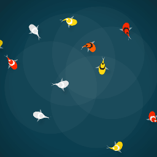

# Interactive Koi Pond 🐟

<p align="center">
  <strong>An interactive, deeply relaxing Koi Pond live wallpaper for Wallpaper Engine and Lively Wallpaper.</strong><br>
  <em>Move your cursor to create ripples, watch the fish scatter, or click to feed them!</em>
</p>

<p align="center">
  <a href="https://rzrabbi.github.io/interactive-koi-pond/demo/">
    
  </a>
  &nbsp;&nbsp;
  <a href="https://steamcommunity.com/sharedfiles/filedetails/?id=3692215641">
    
  </a>
</p>

<p align="center">
  
</p>

---

## 🌟 Features

- **Interactive Environment:** Move your cursor to create dynamic ripples.
- **Feed the Koi:** Click to drop food for the fish to seek out.
- **Shy Fish:** Fish naturally scatter and avoid your cursor.
- **Procedural Animation:** Realistic segment-based fish movement.
- **Aesthetic Caustics:** Procedural light patterns synced to the water and fish.
- **Highly Customizable:** Adjust Wallpaper Engine properties:
  - Koi count, speed, and size
  - Water color hue
  - Fish color themes (Traditional, Neon, Monochrome)
  - Toggleable caustics, feeding, and shy fish behavior
  - Ripple strength

## 📦 Installation

Choose your preferred wallpaper platform below.

---

# 🖥️ Wallpaper Engine

## Option 1: Steam Workshop (Recommended)

The easiest way to install the wallpaper through Steam Workshop.

1. Go to the [Steam Workshop Page](https://steamcommunity.com/sharedfiles/filedetails/?id=3692215641)
2. Click the green **Subscribe** button.
3. Open Wallpaper Engine.
4. The wallpaper will automatically download and appear in your library.

## Option 2: Install from Source

Use this method if you want to modify or develop the wallpaper locally.

1. Clone the repository:

```bash
git clone https://github.com/rzrabbi/interactive-koi-pond.git
```

2. Open Wallpaper Engine.
3. Click **Open Wallpaper** in the bottom-left corner.
4. Select **Open offline wallpaper (animated)**.
5. Choose **Create new wallpaper**.
6. Navigate to the cloned repository.
7. Select the `index.html` file.
8. Customize the wallpaper using the properties panel.

---

# 🌊 Lively Wallpaper

A free alternative to Wallpaper Engine.

## Option 3: Install Using Release Package (Recommended)

1. Go to the [GitHub Releases Page](https://github.com/rzrabbi/interactive-koi-pond/releases)
2. Download the latest `.zip` release package.
3. Install and open Lively Wallpaper.
4. Click the **Add Wallpaper (+)** button.
5. Drag and drop the downloaded `.zip` file into the Lively window.
6. Follow the on-screen setup instructions.

## Option 4: Developer / Git Method

Use this method for development or manual installation.

1. Clone the repository:

```bash
git clone https://github.com/rzrabbi/interactive-koi-pond.git
```

2. Open Lively Wallpaper.
3. Click the **Add Wallpaper (+)** button.
4. Under **Select File**, choose **Choose a File**.
5. Navigate to the cloned repository.
6. Select the `index.html` file.
7. Apply the wallpaper and enjoy.


## 🛠️ Architecture

A unified bridge architecture is utilized to support Wallpaper Engine, Lively Wallpaper, and the Web Demo through a single core engine.

- **Core Engine:** `script.js` natively listens to the Wallpaper Engine API format (`window.wallpaperPropertyListener.applyUserProperties`).
- **Lively Wallpaper Proxy:** The `livelyPropertyListener` function intercepts data, formats it into a Wallpaper Engine object, and pipes it into the core listener.
- **Web Demo UI:** Standard HTML inputs (`/demo/demo.js`) are packaged into Wallpaper Engine objects and piped directly into the core listener.

Updates made to `script.js` are automatically applied across all platforms.

---

## 📜 License

This project is licensed under the MIT License.
